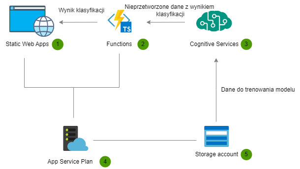

# API pozwalające na automatyczne tagowanie artykułów

## Skład zespołu

- [Nikodem Wójcik](https://github.com/01NikodemW)
- [Ignacy Ruszpel](https://github.com/iruszpel)
- [Łukasz Sobczak](https://github.com/sobczal2)

## Cel projektu

Stworzenie modelu kategoryzującego artykuły na podstawie ich treści. Zauważyliśmy, że serwisu umożliwiające wstawianie artykułów nie ma możliwości automatycznego tagowania artykułów. W związku z tym, postanowiliśmy stworzyć model, który będzie mógł to zrobić zamiast manualnego tagowania przez twórców.

## Opis projektu

W ramach projektu wytrenowaliśmy model, stworzyliśmy API dające dostęp do tego modelu(z wykorzystaniem funkcji Azure'a) oraz stworzyliśmy statyczną aplikację webową, która pozwala na testowanie modelu.

## Scenariusz wykorzystania

Chcę stworzyć artykuł na temat "Python". Wpisuję tytuł i treść artykułu w aplikacji webowej. Po kliknięciu przycisku strzałki aplikacja wyświetla mi tagi, które zostały przypisane do mojego artykułu.

## Opis modelu

Dane wykorzystane do trenowania wzięliśmy ze [zbioru na kaggle](https://www.kaggle.com/datasets/fabiochiusano/medium-articles?fbclid=IwAR24BVxiIGD1-6cEhal0fmnOak7HXM5JJJdReey0EERIFtkm14eujYAn_Oc). Do przekształcenia danych na format akceptowany przez Azure Cognitive Services napisaliśmy prostą aplikację konsolową w C#. Niestety azure nie pozwolił nam na dodanie więcej niż 200 klas więc do tylu tagów musieliśmy się ograniczyć. Czas trenowania modelu na darmowej maszynie zmusił nas też do zredukowania ilości danych do 33k artykułów. Dane podzieliliśmy na dane treningowe i testowe w stosunku 80:20. Model skończył trening z F1-score 35%, precision 53% i recall 26%, co nie jest złym wynikiem biorąc pod uwagę, że mieliśmy 200 klas.

## Opis API

API zostało stworzone w Azure Functions. Wystawiamy jedną funkcje `GetArticleTags` z metodą POST, która przyjmuje argumenty JSON w formacie:

```
{
    "article": "string"
}
```

i zwraca dane w formacie:

```
{
    "class": ["string"]
}
```

Funkcja ta stanowi proxy do API Azure Cognitive Services, łącząc 2 zapytania - stworzenie zadania klasyfikacji i pobranie wyniku w jedno wykonywane synchronicznie.

## Opis aplikacji webowej
Osoba korzystająca z aplikacji w wyznaczone pole podaje treść artykułu, do którego chce znaleźć tagi. Jeżeli tagi zostaną znalezione to zostaną one wyświetlone w polu obok wraz z ich stopniem pewności. Jeżeli nie, zostanie wyświetlona informacja o tym, że żadne pasujące tagi nie zostały znalezione.

## Architektura i opis serwisów



1. Aplikacja frontend w React, która łączy się z API wystawionym na Azure Functions
2. Funkcja działająca na zasadzie HTTP trigger, pełni rolę proxy do RESTowego API z Cognitive Services i sprowadza proces 2 zapytań (zgłoszenie zadania klasyfikacji i odpytywania o wynik) w jedno zapytanie. Wykorzystujemy Consumption plan, dzięki czemu jej zasoby są alokowane tylko po nadejściu zapytania pod dany endpoint
3. Serwis azura, który pozwolił nam w prosty sposób wytrenować model kategoryzujący. Po wdrożeniu model jest dostępny przez restowe API do którego sięga funkcja(2).
4. Wymagane jest posiadanie App Service Plan'u grupującego Functions i Static Web Apps
5. Wykorzystujemy do przechowywania danych potrzebnych do trenowania modelu i pod deploy Functions i Static Web Apps

## Film z prezentacją rozwiązania
[Demonstracja na yt](https://www.youtube.com/watch?v=zSRnAFyl8X0)

## Link do demo aplikacji
[Aplikacja](https://white-cliff-098316803.2.azurestaticapps.net/)
